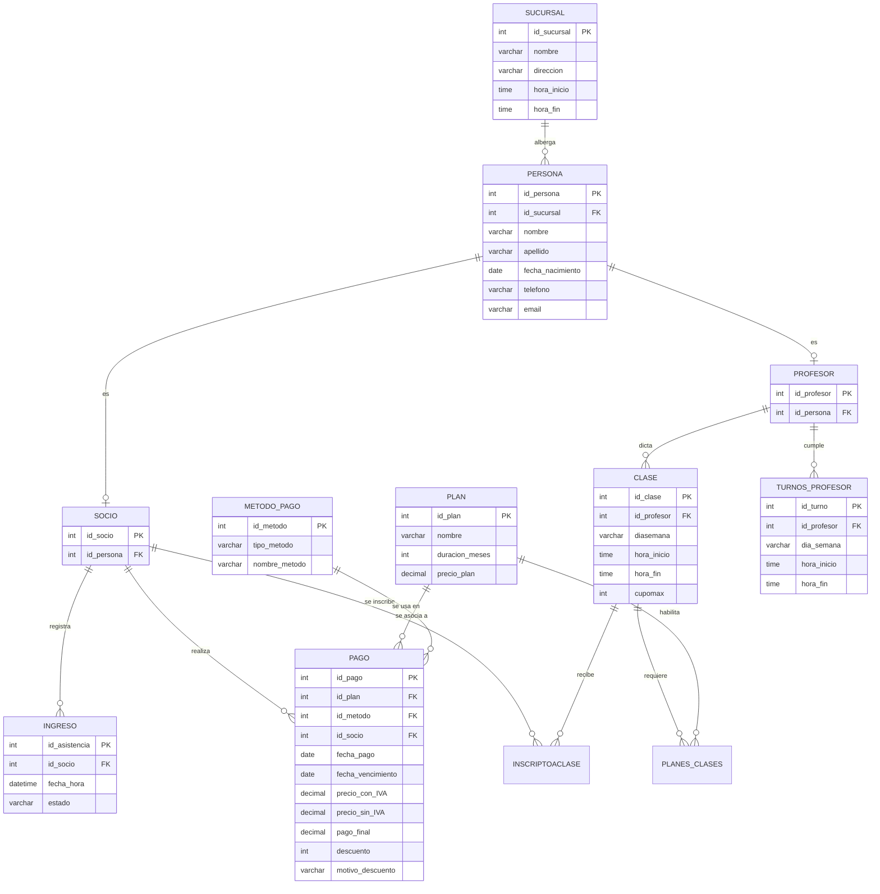

# Sistema de Gestión de Gimnasio (GimnasioDB)

Este repositorio contiene la especificación, diseño físico y población de la base de datos **GimnasioDB**, diseñada para la administración y control de un gimnasio (socios, profesores, sucursales, cobros, asistencia y reservas de clases).

## 🚀 Inicio Rápido (Orden de Ejecución)

Para desplegar la base de datos en tu servidor de SQL Server, ejecutá los scripts de la carpeta `CreacionDB/` en el siguiente orden estricto:

1. **[01_DDL_Estructura.sql](CreacionDB/01_DDL_Estructura.sql)**: Crea la base de datos `GimnasioDB` y define la estructura de tablas, claves primarias y relaciones (claves foráneas).
2. **[02_DML_Datos.sql](CreacionDB/02_DML_Datos.sql)**: Carga datos semilla iniciales (sucursales, socios, profesores, planes, pagos, asistencias y clases).
3. **[03_Vistas.sql](CreacionDB/03_Vistas.sql)**: Crea las vistas de reportes clave para la toma de decisiones y control de negocio.
4. **[04_Procedimientos_Y_Triggers.sql](CreacionDB/04_Procedimientos_Y_Triggers.sql)**: Crea la lógica programable (procedimiento almacenado y triggers) para gestionar pagos, cupos de clases y control de acceso.

---

## 📊 Modelo de Datos (Diagrama de Entidad-Relación)

A continuación se detalla la estructura lógica y relacional de la base de datos:

---

## 🛠️ Detalles de la Estructura de Tablas

| Tabla | Propósito / Descripción | Clave Primaria (PK) | Relaciones Clave (FK) |
|---|---|---|---|
| **SUCURSAL** | Registra las sedes físicas del gimnasio con sus horarios. | `id_sucursal` | - |
| **PERSONA** | Tabla base para el modelo de datos de personas físicas (socios y profesores). | `id_persona` | `id_sucursal` -> SUCURSAL |
| **SOCIO** | Subclase de PERSONA que identifica a los clientes del gimnasio. | `id_socio` | `id_persona` -> PERSONA |
| **PROFESOR** | Subclase de PERSONA que identifica a los instructores del gimnasio. | `id_profesor` | `id_persona` -> PERSONA |
| **INGRESO** | Control de acceso diario de socios a las instalaciones y su estado (Autorizado/Denegado). | `id_asistencia` | `id_socio` -> SOCIO |
| **METODO_PAGO**| Tipos de pago aceptados (Efectivo, MercadoPago, Débito). | `id_metodo` | - |
| **PLAN** | Planes y membresías ofrecidos (Musculación, Crossfit, Libres con duraciones variables). | `id_plan` | - |
| **PAGO** | Historial de transacciones de compra de planes con desglose de IVA y descuentos. | `id_pago` | `id_plan` -> PLAN, `id_metodo` -> METODO_PAGO, `id_socio` -> SOCIO |
| **CLASE** | Horarios de las actividades ofrecidas en el gimnasio y su cupo máximo. | `id_clase` | `id_profesor` -> PROFESOR |
| **PLANES_CLASES** | Relación de muchos a muchos que define qué planes habilitan a qué clases. | `(id_clase, id_plan)` | `id_clase` -> CLASE, `id_plan` -> PLAN |
| **TURNOS_PROFESOR** | Disponibilidad y asignación horaria laboral de los profesores. | `id_turno` | `id_profesor` -> PROFESOR |
| **INSCRIPTOACLASE**| Reservas de cupo que realizan los socios para asistir a una clase específica. | `id_inscripto` | `id_socio` -> SOCIO, `id_clase` -> CLASE |

---

## 📈 Vistas de Reporte Implementadas

Para facilitar la administración del negocio, el script **[03_Vistas.sql](CreacionDB/03_Vistas.sql)** define las siguientes vistas listas para consultar:

1. **`recaudacion_mensual`**: Calcula el total cobrado agrupado por mes y año. Útil para métricas financieras generales.
2. **`perdida_mensual`**: Calcula la brecha entre el precio de lista (con IVA) y lo efectivamente pagado (debido a descuentos aplicados), agrupado por mes y año.
3. **`recaudacion_metodo_pago`**: Sumariza los ingresos históricos según el medio de pago utilizado.
4. **`socio_proximo_a_vencer`**: Lista de socios cuya membresía expira en los próximos 7 días (excluyendo los ya vencidos). Permite acciones proactivas de renovación.
5. **`socio_plan_vencido`**: Lista de socios con planes cuya fecha de vencimiento es anterior al día de la fecha. Útil para control de acceso y telemarketing.

---

## ⚙️ Lógica Programable Implementada (Procedimiento Almacenado y Triggers)

Para automatizar reglas críticas del negocio sin sobrecargar el cliente, el script **[04_Procedimientos_Y_Triggers.sql](CreacionDB/04_Procedimientos_Y_Triggers.sql)** agrega los siguientes componentes:

### 1. Procedimiento Almacenado `sp_RegistrarPago`
* **Propósito**: Automatizar la compra y facturación de membresías.
* **Operación**:
  - Recibe el socio, plan, medio de pago y el descuento opcional (de 0 a 100%).
  - Busca el precio del plan y calcula dinámicamente el IVA (`precio_sin_IVA = precio_con_IVA / 1.21`).
  - Proyecta la fecha de expiración (`fecha_vencimiento`) sumando la duración en meses del plan a la fecha de hoy.
  - Inserta el registro completo de forma transaccional protegiendo la consistencia de datos.

### 2. Trigger `trg_ControlCupoClase` (en `INSCRIPTOACLASE`)
* **Propósito**: Impedir la sobre-inscripción a clases del gimnasio.
* **Operación**:
  - Se ejecuta `AFTER INSERT, UPDATE` en la tabla `INSCRIPTOACLASE`.
  - Evalúa si el número total de inscriptos para las clases afectadas supera el cupo máximo (`cupomax`) configurado en `CLASE`.
  - En caso de excederse, ejecuta un `ROLLBACK` y cancela la transacción lanzando un error con `RAISERROR`.

### 3. Trigger `trg_ValidarIngreso` (en `INGRESO`)
* **Propósito**: Controlar de forma autónoma el ingreso físico de los socios.
* **Operación**:
  - Se ejecuta `AFTER INSERT` en la tabla `INGRESO`.
  - Compara si el socio posee un pago activo cuya `fecha_vencimiento >= GETDATE()`.
  - Modifica de forma automática la columna `estado` a `'Autorizado'` si tiene un plan vigente, o a `'Denegado'` si se encuentra vencido o sin registrar pagos.

---

## 👥 Autores

* **Delfina Sarkis**
* **Tomás Juárez**
* **Alejandro Gabriel Corzo**
